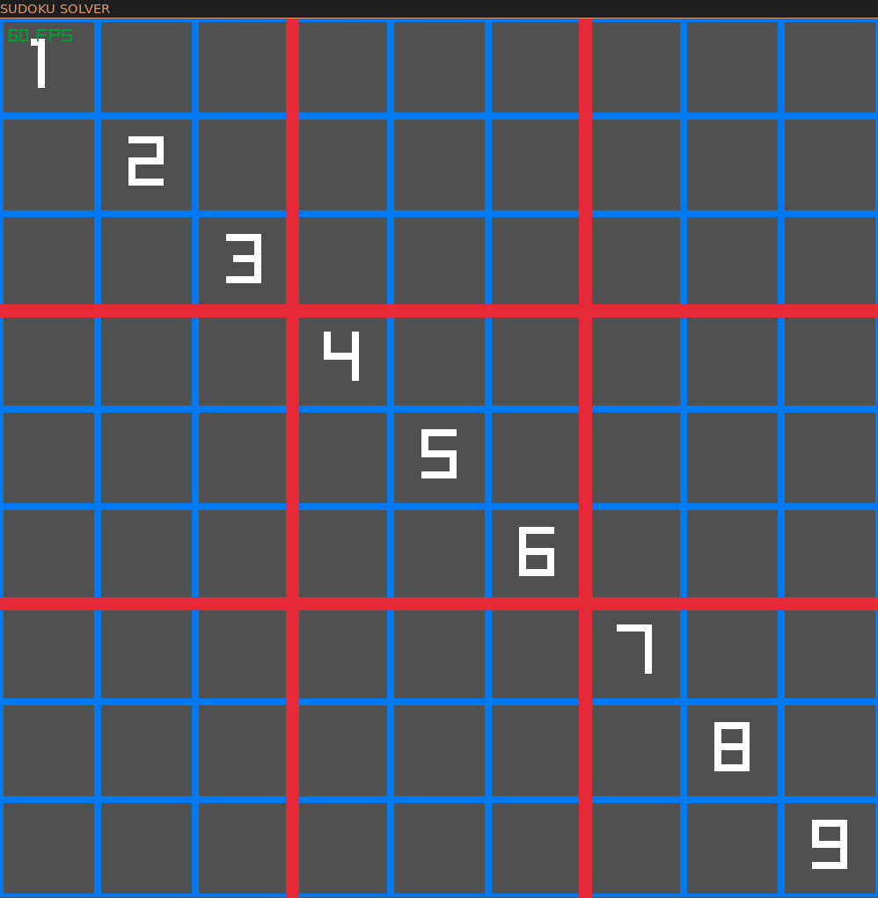
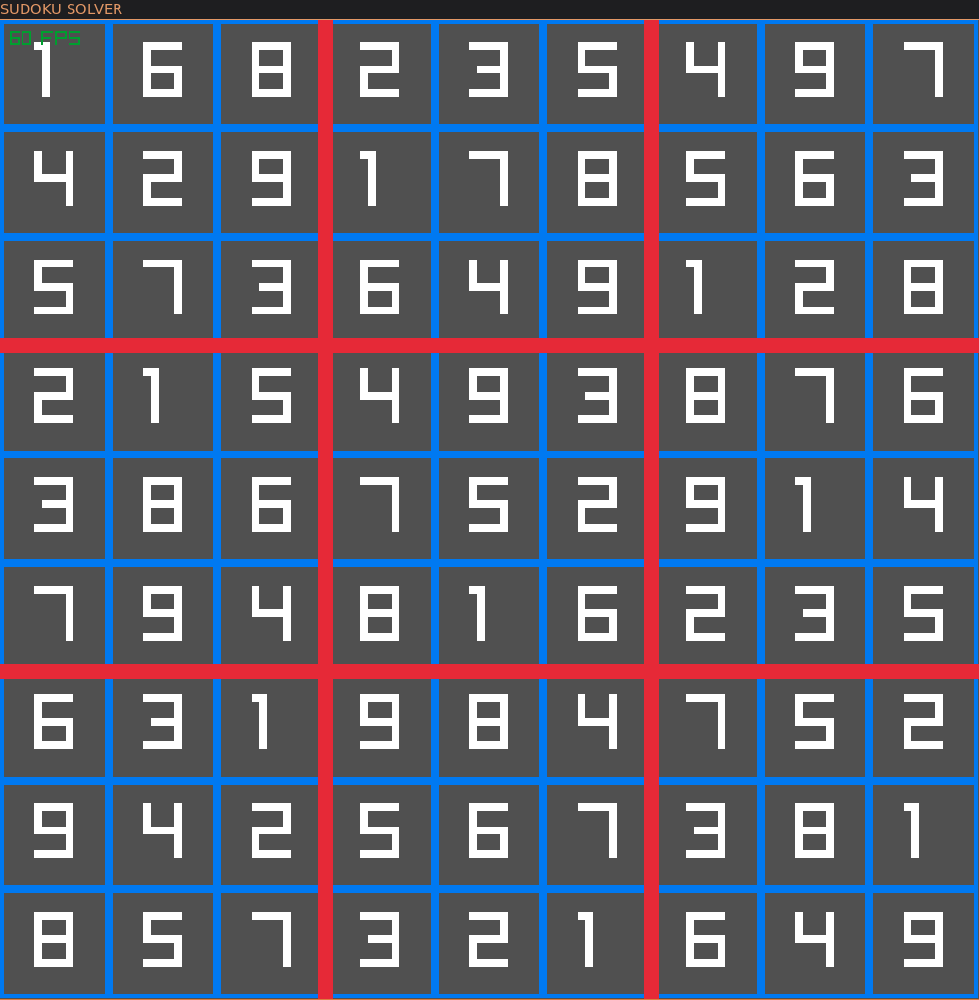

# SUDOKU SOLVER
Sudoku solver using backtracking algorithm

## Sudoku game
To solve a sudoku, you need a sudoku. So i made a basic implmentation of one with [Raylib](https://www.raylib.com/).

#### Example of a basic board

You can simply put any numbers in the cells you want, just **hover** the cell and **press a number**. If a number is not valid or can't be placed, it just won't.

## Sudoku solver
You can solve the sudoku by pressing **space**.

#### Example of a solved board

## Sources
[Wikipedia - Backtracking](https://en.wikipedia.org/wiki/Sudoku_solving_algorithms#Backtracking)
[Raylib](https://www.raylib.com/)
[Youtube Video that helped](https://www.youtube.com/watch?v=eqUwSA0xI-s)